# Hi, I'm Praveen Kumar Ravikumar 👋

**Technical Lead** — AI agent tooling, developer infrastructure & platform engineering

🟢 **Open to work**

## About Me

- 🧠 Building and leading work across autonomous AI agents, LLM tooling, and the developer/platform infrastructure that runs them.
- 🛠️ Hands-on across the stack — from low-level inference (C++) to agent orchestration (Go, TypeScript, Python) to the containers/CI/CD/service-mesh layer underneath it all.
- 📈 Currently deepening hands-on production-operations expertise (Kubernetes, Istio, CI/CD release engineering) through the SkillFyme DevOps with AI Masters Program.
- 💬 Ask me about AI agents, LLM tooling, developer infrastructure, or container/platform engineering.
- 📫 praveenperfeitoo@gmail.com · [LinkedIn](https://in.linkedin.com/in/praveen-perfeito-75852a64)

## 🧰 Tech Stack

## 📌 Featured Projects

### [pentagi](https://github.com/PraveenPerfeito/pentagi) — Go
Fully autonomous AI Agents system capable of performing complex penetration testing tasks.

### [openhuman](https://github.com/PraveenPerfeito/openhuman) — Rust
Your Personal AI super intelligence. Private, simple, and extremely powerful.

### [Web-Scrapling](https://github.com/PraveenPerfeito/Web-Scrapling) — Python
An adaptive web scraping framework that handles everything from a single request to a full-scale crawl.

### [OpenCLI](https://github.com/PraveenPerfeito/OpenCLI) — JavaScript
Turns any website into a CLI, using your logged-in browser via an AI agent.

### [llama.cpp](https://github.com/PraveenPerfeito/llama.cpp) — C++
LLM inference in C/C++.

### [vercel-ai](https://github.com/PraveenPerfeito/vercel-ai) — TypeScript · fork of [vercel/ai](https://github.com/vercel/ai)
The AI Toolkit for TypeScript, from the creators of Next.js — a free, open-source library for building AI-powered applications and agents.

## 📊 GitHub Stats

Stats/languages/trophy cards are static SVGs regenerated daily by [a GitHub Action](.github/workflows/update-readme-cards.yml) and committed here — the public github-readme-stats/github-profile-trophy hosts are unreliable (rate limits, billing caps), so this avoids depending on them at page-load time.
